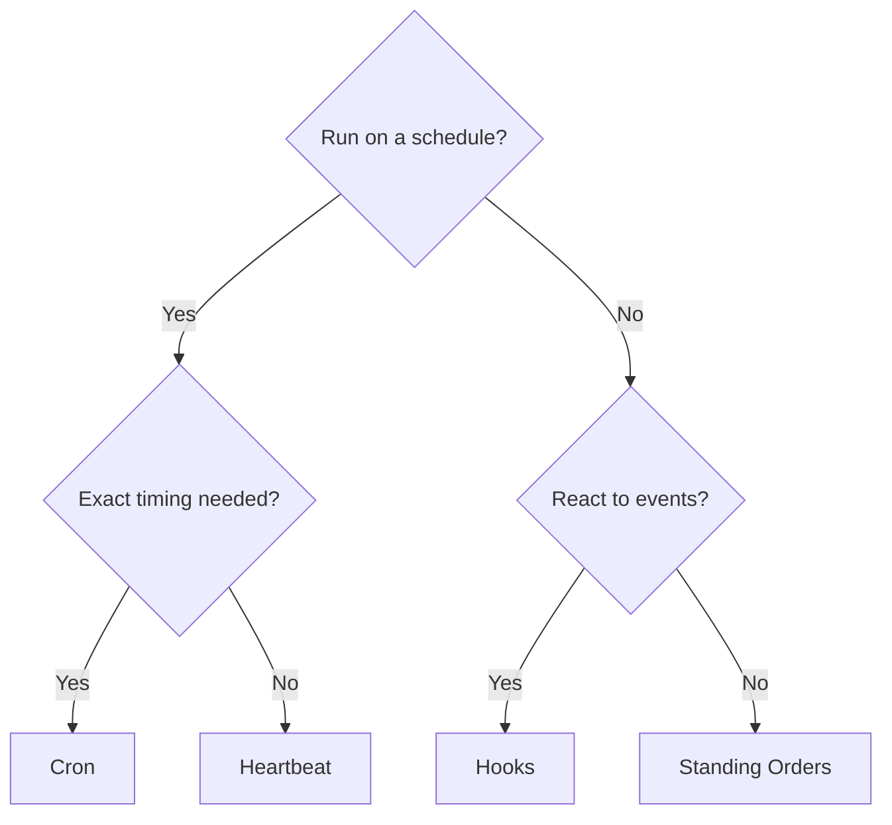

# Automation & Tasks

OpenClaw runs work in the background through tasks, scheduled jobs, event hooks, and standing instructions. This page helps you choose the right mechanism and understand how they fit together.

## Quick decision guide

| Use case                             | Recommended         | Why                                      |
| ------------------------------------ | ------------------- | ---------------------------------------- |
| Check inbox every 30 min             | Heartbeat           | Batches with other checks, context-aware |
| Send daily report at 9 AM sharp      | Cron (isolated)     | Exact timing needed                      |
| Monitor calendar for upcoming events | Heartbeat           | Natural fit for periodic awareness       |
| Run weekly deep analysis             | Cron (isolated)     | Standalone task, can use different model |
| Remind me in 20 minutes              | Cron (main, `--at`) | One-shot with precise timing             |
| React to commands or lifecycle       | Hooks               | Event-driven, runs custom scripts        |
| Persistent agent instructions        | Standing orders     | Injected into every session              |

## Core concepts

### Tasks

The background task ledger tracks all detached work: ACP runs, subagent spawns, isolated cron executions, and CLI operations. Tasks are records, not schedulers. Use `openclaw tasks list` and `openclaw tasks audit` to inspect them.

See [Background Tasks](/automation/tasks).

### Scheduled tasks (cron)

Cron is the Gateway's built-in scheduler for precise timing. It persists jobs, wakes the agent at the right time, and can deliver output to a chat channel or webhook. Supports one-shot reminders, recurring expressions, and inbound webhook triggers.

See [Scheduled Tasks](/automation/cron-jobs).

### Task Flow

Task Flow is the flow orchestration substrate above background tasks. It manages durable multi-step flows with managed and mirrored sync modes, revision tracking, and `openclaw tasks flow list|show|cancel` for inspection.

See [Task Flow](/automation/taskflow).

### Heartbeat

Heartbeat is a periodic main-session turn (default every 30 minutes). It batches multiple checks (inbox, calendar, notifications) in one agent turn with full session context. Heartbeat turns do not create task records. Use `HEARTBEAT.md` to define what the agent checks.

See [Heartbeat](/gateway/heartbeat).

### Hooks

Hooks are event-driven scripts triggered by agent lifecycle events (`/new`, `/reset`, `/stop`), session compaction, gateway startup, message flow, and tool calls. Hooks are automatically discovered from directories and can be managed with `openclaw hooks`.

See [Hooks](/automation/hooks).

### Standing orders

Standing orders grant the agent permanent operating authority for defined programs. They live in workspace files (typically `AGENTS.md`) and are injected into every session. Combine with cron for time-based enforcement.

See [Standing Orders](/automation/standing-orders).

## How they work together

- **Heartbeat** handles routine monitoring (inbox, calendar, notifications) in one batched turn every 30 minutes.
- **Cron** handles precise schedules (daily reports, weekly reviews) and one-shot reminders. All cron executions create task records.
- **Hooks** react to specific events (tool calls, session resets, compaction) with custom scripts.
- **Standing orders** give the agent persistent context and authority boundaries.
- **Task Flow** coordinates multi-step flows above individual tasks.
- **Tasks** automatically track all detached work so you can inspect and audit it.

## Related

- [Task Flow](/automation/taskflow) — flow orchestration above tasks
- [Heartbeat](/gateway/heartbeat) — periodic main-session turns
- [Configuration Reference](/gateway/configuration-reference) — all config keys
